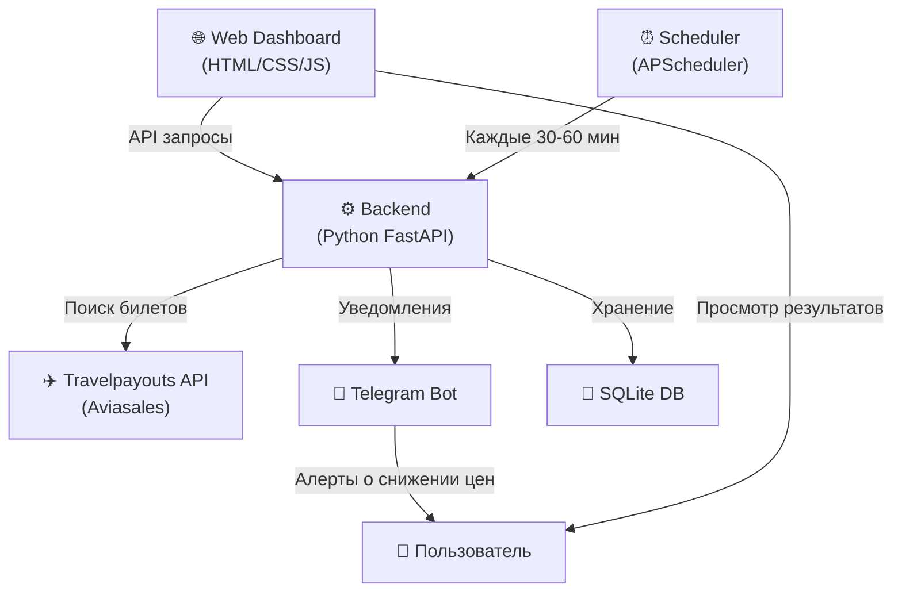

# 🛫 Парсер дешёвых авиабилетов с дашбордом и уведомлениями в Telegram

## Описание проекта

Система мониторинга цен на авиабилеты, которая:
- Ищет самые дешёвые билеты через Aviasales (Travelpayouts API) — единый агрегатор, покрывающий Победу, Аэрофлот, S7 и 700+ авиакомпаний
- Показывает ТОП-5 предложений с фильтрацией по параметрам
- Отправляет уведомления в Telegram при снижении цен
- Автоматически обновляет данные каждые 30–60 минут
- Имеет красивую веб-панель управления

---

## User Review Required

> [!IMPORTANT]
> **API ключ Travelpayouts** — для работы парсера нужен бесплатный API-токен с [Travelpayouts](https://www.travelpayouts.com/). Регистрация бесплатная, токен выдаётся мгновенно.

> [!IMPORTANT]
> **Telegram Bot Token** — нужно создать бота через [@BotFather](https://t.me/BotFather) в Telegram и получить токен. Также нужен Chat ID для отправки уведомлений.

> [!WARNING]
> **Ограничения API**: Travelpayouts API (бесплатный) даёт кэшированные данные с задержкой ~15-30 минут. Для real-time цен нужен платный доступ или парсинг сайтов (что нарушает ToS). Рекомендую начать с бесплатного API — его точности достаточно для поиска выгодных предложений.

---

## Открытые вопросы

> [!IMPORTANT]
> 1. Есть ли у тебя уже аккаунт Travelpayouts или нужна инструкция по регистрации?
> 2. Telegram бот уже создан или создать инструкцию?
> 3. Какие направления интересуют больше всего? (Россия, СНГ, Европа, весь мир?)

---

## Архитектура



## Стек технологий

| Компонент | Технология | Причина |
|-----------|-----------|---------|
| Backend | **Python 3.11+ / FastAPI** | Быстрый async, автодокументация API |
| Планировщик | **APScheduler** | Лёгкий, надёжный cron-like планировщик |
| БД | **SQLite + aiosqlite** | Не требует установки, хватает для задачи |
| Telegram | **python-telegram-bot** | Официальная библиотека, async |
| Frontend | **HTML/CSS/JS (Vanilla)** | Красивый дашборд без зависимостей |
| API билетов | **Travelpayouts API** | Покрывает 700+ авиакомпаний включая Победу и Аэрофлот |

---

## Proposed Changes

### Backend (Python FastAPI)

#### [NEW] `flight-parser/backend/main.py`
- FastAPI приложение с CORS
- Эндпоинты:
  - `POST /api/search` — поиск билетов по параметрам
  - `GET /api/tracking` — список отслеживаемых маршрутов
  - `POST /api/tracking` — добавить маршрут в отслеживание
  - `DELETE /api/tracking/{id}` — удалить маршрут
  - `GET /api/results/{tracking_id}` — ТОП-5 результатов по маршруту
  - `POST /api/settings` — настройки Telegram
  - `GET /api/settings` — получить настройки

#### [NEW] `flight-parser/backend/aviasales_client.py`
- Клиент для Travelpayouts API v1/v2:
  - `/v1/prices/cheap` — самые дешёвые билеты
  - `/v2/prices/latest` — последние найденные цены
  - `/v1/prices/calendar` — календарь цен
  - `/v2/prices/month-matrix` — матрица цен по месяцам
- Фильтрация по параметрам:
  - Класс (эконом/бизнес)
  - Пересадки (прямой/с пересадками)
  - Багаж (через пост-фильтрацию)
  - Даты вылета/прилёта
  - Количество пассажиров

#### [NEW] `flight-parser/backend/telegram_notifier.py`
- Отправка уведомлений через Telegram Bot API
- Форматирование сообщений с эмодзи и Markdown
- Уведомления при:
  - Снижении цены на отслеживаемый маршрут
  - Появлении нового дешёвого билета
  - Периодический дайджест ТОП-5

#### [NEW] `flight-parser/backend/scheduler.py`
- APScheduler для периодического обновления
- Интервал: **30 минут** (оптимально — Travelpayouts кэширует данные ~15–30 мин, чаще бессмысленно)
- Проверка изменения цен и триггер уведомлений

#### [NEW] `flight-parser/backend/database.py`
- SQLite схема:
  - `tracking_routes` — отслеживаемые маршруты с параметрами
  - `price_history` — история цен для аналитики
  - `settings` — настройки (API ключи, Telegram токен)

#### [NEW] `flight-parser/backend/models.py`
- Pydantic модели для валидации данных

#### [NEW] `flight-parser/backend/requirements.txt`
- Все зависимости Python

---

### Frontend (Web Dashboard)

#### [NEW] `flight-parser/frontend/index.html`
- Главная страница дашборда
- Секции:
  - 🔍 **Поиск билетов** — форма с параметрами
  - 📊 **ТОП-5 результатов** — карточки с ценами
  - 📡 **Отслеживание** — список отслеживаемых маршрутов
  - ⚙️ **Настройки** — API ключи, Telegram

#### [NEW] `flight-parser/frontend/styles.css`
- Премиальный дизайн:
  - Тёмная тема с градиентами
  - Glassmorphism эффекты
  - Плавные анимации
  - Адаптивная вёрстка
  - Карточки билетов с hover-эффектами

#### [NEW] `flight-parser/frontend/app.js`
- Логика фронтенда:
  - Взаимодействие с API backend'а
  - Динамическое обновление UI
  - Валидация форм
  - Автокомплит аэропортов (IATA коды)

---

### Конфигурация

#### [NEW] `flight-parser/.env.example`
- Шаблон переменных окружения:
  ```
  TRAVELPAYOUTS_TOKEN=your_token_here
  TELEGRAM_BOT_TOKEN=your_bot_token_here
  TELEGRAM_CHAT_ID=your_chat_id_here
  ```

#### [NEW] `flight-parser/README.md`
- Инструкция по установке и запуску

---

## Параметры поиска билетов

Форма поиска будет включать:

| Параметр | Тип | Описание |
|----------|-----|----------|
| Откуда | Текст + автокомплит | Город/аэропорт вылета (IATA код) |
| Куда | Текст + автокомплит | Город/аэропорт прилёта |
| Дата вылета | Дата | Точная дата или «гибкие даты» |
| Дата возврата | Дата | Для билетов туда-обратно |
| Только туда | Чекбокс | В одну сторону |
| Прямой рейс | Чекбокс | Без пересадок |
| Макс. пересадок | Число | 0-3 |
| Класс | Выбор | Эконом / Бизнес |
| Багаж | Чекбокс | Только с багажом |
| Макс. цена | Число | Верхний порог цены в ₽ |

---

## Формат вывода ТОП-5

Каждая карточка билета отображает:
- 🏷️ Цена (крупно, акцентный цвет)
- ✈️ Авиакомпания + номер рейса
- 📅 Дата и время вылета/прилёта
- ⏱️ Длительность перелёта
- 🔄 Количество пересадок
- 🧳 Информация о багаже
- 📈 Тренд цены (↑↓→)
- 🔗 Ссылка на покупку (через Aviasales)

---

## Telegram уведомления

Формат сообщения:
```
✈️ Снижение цены!

Москва → Стамбул
📅 15 июля 2026
💰 12 450 ₽ (было 15 800 ₽, -21%)
🛫 Победа, DP 812
⏱️ 3ч 25мин, прямой

🔗 Купить: [ссылка]
```

---

## Verification Plan

### Автоматические проверки
```bash
# Запуск backend
cd flight-parser/backend && pip install -r requirements.txt && python main.py

# Тест API endpoints
curl http://localhost:8000/docs  # Swagger UI
```

### Ручная верификация
- Проверка поиска билетов через дашборд
- Проверка получения уведомления в Telegram
- Проверка обновления данных по расписанию

---

## 💡 10 вопросов для улучшения продукта

1. **Хочешь ли ты отслеживать «гибкие даты»?** Например, «самый дешёвый билет в Стамбул в июле» — система покажет лучшие дни для вылета.

2. **Нужен ли «Режим охотника»?** Ты задаёшь бюджет (например, до 10 000₽) и список городов — система мониторит ВСЕ направления и уведомляет, когда цена падает ниже порога.

3. **Хочешь ли видеть график истории цен?** Визуализация тренда цен за последние 30 дней, чтобы понимать — цена сейчас низкая или стоит подождать.

4. **Нужна ли «Карта дешёвых билетов»?** Интерактивная карта мира, где по клику на город видно минимальную цену из твоего города — помогает найти неожиданно дешёвые направления.

5. **Хочешь ли агрегацию из нескольких источников?** Кроме Aviasales, добавить Google Flights и Kiwi.com для сравнения цен между агрегаторами.

6. **Нужна ли фильтрация по времени вылета?** Например, «только утренние рейсы» или «вылет после 18:00» — для тех, кому важно удобное время.

7. **Хочешь ли «Групповой поиск»?** Поиск билетов для группы людей (разные аэропорты вылета, один пункт назначения) — полезно для путешествий с друзьями.

8. **Нужно ли учитывать стоимость отелей?** Показывать «билет + отель» суммарную стоимость, чтобы оценить полный бюджет поездки.

9. **Хочешь ли «Ошибочные тарифы» (Error Fares)?** Мониторинг аномально низких цен, которые авиакомпании выставляют по ошибке — нужно покупать быстро, пока не исправили.

10. **Нужна ли мобильная версия или Telegram-бот с полным управлением?** Вместо веб-панели (или в дополнение) — полноценный Telegram-бот, где можно искать, настраивать и получать результаты прямо в мессенджере.
